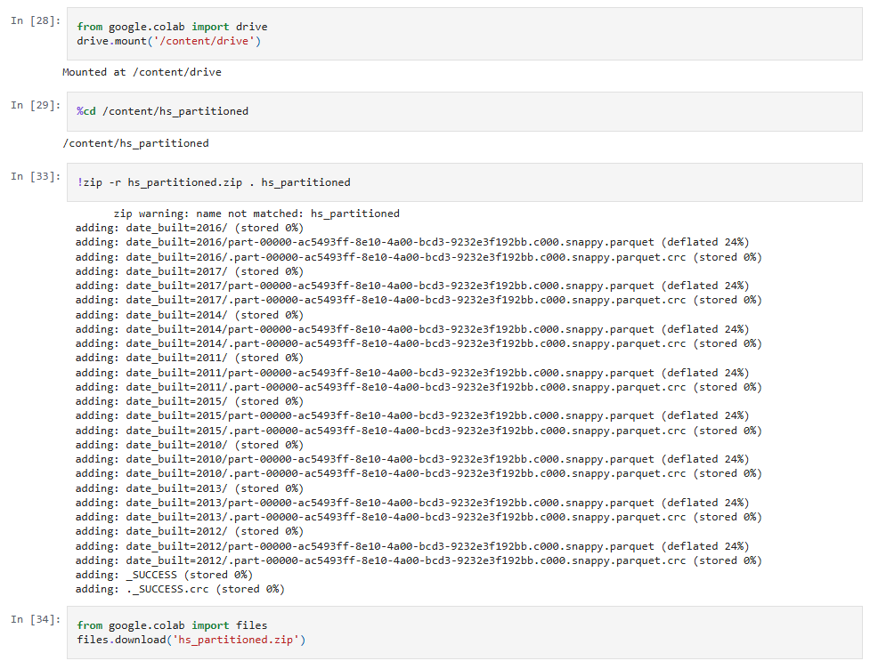

# HomeSales

This challenge was completed within the Google Colab environment. 

***Note***: in the final few blocks of code in the `.ipynb` file, there is a slight workaround used to download the parquet data. Since colab does not allow direct downloads of folders created within the environment, first you have to mount your google drive (give colab access to your drive files), save zip up the desired folder, and download that zipped folder. Image included below for reference. The afformentioned parquet data is available in the `hs_partitioned` folder.

## Steps towards sucess
Below are all steps followed for this challenge:
- Rename the `Home_Sales_starter_code.ipynb` file as `Home_Sales.ipynb`.
- Import the necessary PySpark SQL functions for this assignment.
- Read the `home_sales_revised.csv` from the provided AWS S3 bucket location into a PySpark DataFrame.
- Create a temporary table called home_sales.
- Answer the following questions using SparkSQL:
  - What is the average price for a four-bedroom house sold for each year? Round off your answer to two decimal places.
  - What is the average price of a home for each year the home was built, that has three bedrooms and three bathrooms? Round off your answer to two decimal places.
  - What is the average price of a home for each year the home was built, that has three bedrooms, three bathrooms, two floors, and is greater than or equal to 2,000 square feet? Round off your answer to two decimal places.
  - What is the average price of a home per `view` rating having an average home price greater than or equal to $350,000? Determine the run time for this query, and round off your answer to two decimal places.
- Cache your temporary table `home_sales`.
- Check if your temporary table is cached.
- Using the cached data, run the last query that calculates the average price of a home per "view" rating having an average home price greater than or equal to $350,000. Determine the runtime and compare it to uncached runtime.
- Partition by the `date_built` field on the formatted parquet home sales data.
- Create a temporary table for the parquet data.
- Run the last query that calculates the average price of a home per `view` rating having an average home price greater than or equal to $350,000. Determine the runtime and compare it to uncached runtime.
- Uncache the `home_sales` temporary table.
- Verify that the `home_sales` temporary table is uncached using PySpark.
- Download your `Home_Sales.ipynb` file and upload it into your `Home_Sales` GitHub repository.
